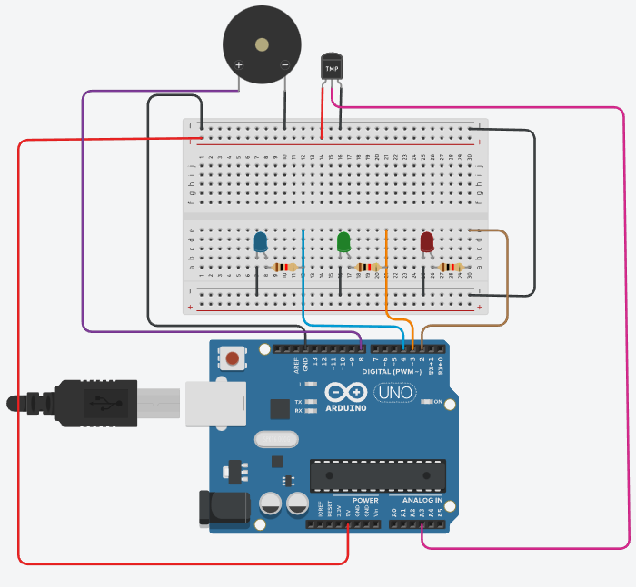

# Extens-o-IoT-Avalia-o
Repositório destinado ao projeto final do Curso de Extensão de IoT

AVALIAÇÃO CURSO DE EXTENSÃO IOT PARA INICIANTES:
-------------------------------------------------------------------------------------------------------------------------------------------------------------------------
Projeto de Termômetro com indicação visual via LED e sonora.
-------------------------------------------------------------------------------------------------------------------------------------------------------------------------
Descrição:

Montei um projeto de termômetro que além de mostrar a temperatura indique também 3 estados: 2 de alerta e 1 de normalidade. Sendo estes estados indicados através de três LEDs e "bips" sonoros.

-LED Azul: Temperatura baixa!- É acionado um alerta quando a temperatura está abaixo de 0ºC. O som é ativado.

-LED Verde: Temperatura normal - Definido com um estado de "neutralidade", setado entre 1ºC e 29ºC. Não são emitidos sons nesse estado.

-LED Vermelho: Temperatura elevada!- É acionado um alerta quando a temperatura ultrapassa os 30ºC. O som é ativado

A temperatura e as mensagens de alerta são transmitidas através do monitor serial.
-------------------------------------------------------------------------------------------------------------------------------------------------------------------------

<a href="Avaliacao_IoT_Termômetro.ino">Clique aqui para o código.<a/>
